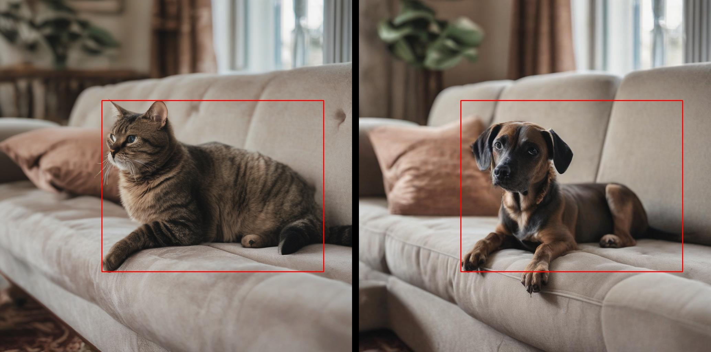

# Reprodução: Img-Diff (CVPR 2025) - Mário Guerra

Este repositório contém a implementação e reprodução dos métodos propostos no artigo **"Img-Diff: Contrastive Data Synthesis for Multimodal Large Language Models"**, desenvolvido como projeto final da disciplina de Visão Computacional. O projeto implementa um pipeline automatizado para a síntese de dados contrastivos, visando melhorar a capacidade de MLLMs (Multimodal LLMs) em detectar diferenças finas e granulares entre imagens semelhantes.

## 📋 Estrutura do Projeto

O pipeline foi implementado seguindo a metodologia do artigo, dividido em três módulos principais:

1. **Geração de Pares (Module A):** Geração de pares de imagens quase idênticos focados em substituição de objetos (*Object Replacement*), utilizando *Stable Diffusion XL*.
2. **Detecção de Diferenças (Module B - Difference Area Generator):** Identificação e segmentação das regiões modificadas utilizando *FastSAM* para segmentação e *CLIP* para verificação de similaridade semântica.
3. **Geração de Legendas (Module C - Difference Captions Generator):** Descrição textual das diferenças utilizando um MLLM (*LLaVA*) para criar o dataset final no formato de instrução visual.

## Organização de Pastas
```text
img-diff-repro/
├── data/
│   ├── generated_images/   # Saída do Módulo A (Pares de Imagens)
│   ├── caption_images/     # Saída 1 do Módulo B (Pares de Imagens com bounding box)
│   ├── raw_captions/       # Saída 2 do Módulo B (json com coordenadas e similaridade das imagens)
│   └── final_dataset/      # Saída do Módulo C (JSON Final para treinamento de VLM)
├── scripts/
│   ├── 01_generate_pairs.py      # Scripts de geração (SDXL + Prompt Engineering)
│   ├── 02_filter_differences.py  # Scripts de detecção (FastSAM + CLIP + IoU Filter)
│   └── 03_create_json.py         # Scripts de descrição (LLaVA-NeXT/1.5)
├── README.md               # Este arquivo
└── requirements.txt        # Dependências do projeto
```

## 🚀 Instalação e Configuração

**Importante:** Devido a conflitos de versão conhecidos entre torchvision, fastsam e bibliotecas de aceleração, siga estritamente os passos abaixo para configurar o ambiente.

### 1. Criar Ambiente Conda

```bash
conda create -n img-diff python=3.10 -y
conda activate img-diff
```

### 2. Instalar PyTorch (Manual)

É crucial instalar o PyTorch compatível com CUDA antes das outras bibliotecas para evitar conflitos de dependência.

```bash
# Para Linux/Windows com GPU NVIDIA (CUDA 12.1)
pip install torch torchvision --index-url [https://download.pytorch.org/whl/cu121](https://download.pytorch.org/whl/cu121)
```

### 3. Instalar Dependências Gerais

```bash
pip install -r requirements.txt
```

### 4. Instalar Ferramentas Específicas

Algumas ferramentas essenciais do artigo precisam ser instaladas diretamente dos repositórios oficiais.

```bash
# CLIP da OpenAI (Para cálculo de similaridade de cosseno)
pip install git+[https://github.com/openai/CLIP.git](https://github.com/openai/CLIP.git)

# Ultralytics (Necessário para rodar o FastSAM)
pip install ultralytics

# BitsAndBytes (Opcional: Para rodar LLaVA em 4-bit se tiver pouca VRAM)
pip install bitsandbytes
```

## 🛠️ Como Executar

Siga a ordem do pipeline para gerar o dataset completo.

### Passo 1: Gerar Pares de Imagens (Generation)

Este script utiliza o SDXL com sementes fixas para gerar pares de imagens (Original vs Modificada) baseadas em prompts de substituição.

```bash
python /scripts/01_generate_pairs.py
```

**Saída:** As imagens serão salvas em ```data/generated_images/``` (pastas ```left``` e ```right```).

### Passo 2: Detectar Áreas de Diferença (Detection)

Analisa os pares gerados, aplica o FastSAM para segmentar objetos e utiliza o CLIP para validar quais regiões sofreram alterações visuais significativas (< 0.85 similaridade).

```bash
python /scripts/02_filter_differences.py
```

**Saída 1:** O script gera imagens com bounding boxes vermelhas para visualização das diferenças detectadas que são salvas em ```data/caption_images/``` (pastas ```left``` e ```right```).

**Saída 2:** O script gera arquivos json com as coordenadas das bounding boxes, a similaridade e os paths para cada par de imagens (são salvos em ```data/raw_captions/```).

### Passo 3: Gerar Legendas e JSON Final (Captioning)

Utiliza o LLaVA para gerar descrições semânticas das diferenças encontradas e consolida tudo em um arquivo JSON pronto para treinamento.

```bash
python /scripts/03_create_json.py
```

**Saída Final:** ```data/final_dataset/img_diff_train.json```

## 📊 Exemplo de Resultado (JSON)

O arquivo final segue o formato de Visual Instruction Tuning descrito no paper:




```json
{
  "conversations": [
    {
      "from": "human",
      "value": "Analyse the left image and the right image (separated by the black vertical bar). What is the difference between the red bounding box area in each image? Answer the question in a few concise sentences"
    },
    {
      "from": "llm",
      "value": "The difference between the red bounding box area in the left and right images is that in the left image, the cat is inside the red box, while in the right image, the dog is inside the red box."
    }
  ],
  "bbox": [
    0.29,
    0.29,
    0.92,
    0.77
  ],
  "captions1": "The main object in this image is a cat.",
  "captions2": "The main object in this image is a dog.",
  "image_left": "data/caption_images/left/caption_0.jpg",
  "image_right": "data/caption_images/right/caption_0.jpg"
}
```

## 📚 Referências

**Artigo Original:** Jiao, Q., Chen, D., Huang, Y., Ding, B., Li, Y., & Shen, Y. (2024). Img-Diff: Contrastive Data Synthesis for Multimodal Large Language Models. arXiv preprint arXiv:2408.04594. 

**FastSAM:** Zhao, X., et al. (2023). Fast Segment Anything. 

**SDXL:** Podell, D., et al. (2023). SDXL: Improving Latent Diffusion Models for High-Resolution Image Synthesis.